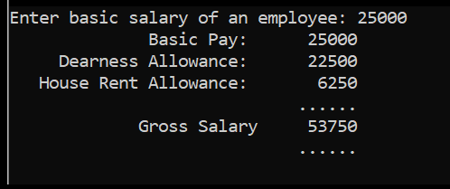

# Gross Salary

Basic Salary <25000: HRA = 20%, DA = 80%  
Basic Salary >=25000: HRA = 25%, DA = 90%  
Basic Salary >=40000: HRA = 30%, DA = 95%  

# About this Program

To write a C++ Program to input basic salary of an employee and calculate it's Gross salary using the above data

# Output

